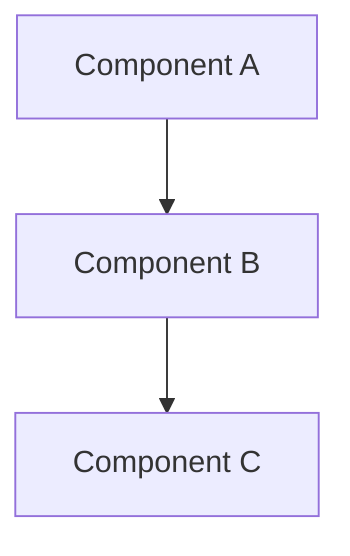

# System Architecture Document Template

## 1. Overall Architecture Overview
Briefly describe the overall system architecture and design philosophy.

## 2. Component Breakdown
- Component 1: Function and main responsibilities
- Component 2: Function and main responsibilities
(Decompose the system into main modules/components as needed)

## 3. Component Relationships & Dependencies
Describe the relationships and dependencies between components using text or diagrams (e.g., Mermaid).

## 4. Main Workflows
Describe the core business or data flows of the system.

## 5. Technology Choices & Rationale
List key technology choices and the reasons for each.

## 6. Constraints & Considerations
Describe any constraints, assumptions, or important considerations in the architecture.

---

> Please supplement and refine the above sections according to your actual project.