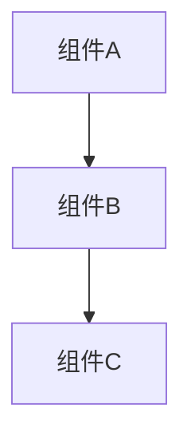

# 系统架构文档模板

## 1. 总体架构描述
简要说明系统的整体架构设计思路。

## 2. 组件划分
- 组件1：功能说明、主要职责
- 组件2：功能说明、主要职责
（请按实际系统分解主要模块/组件）

## 3. 组件关系与依赖
用文字或图示（如 Mermaid）描述各组件之间的关系和依赖。

## 4. 主要流程
描述系统的核心业务流程或数据流。

## 5. 技术选型与理由
列出关键技术选型及其原因。

## 6. 约束与注意事项
说明架构设计中的限制、假设或注意事项。